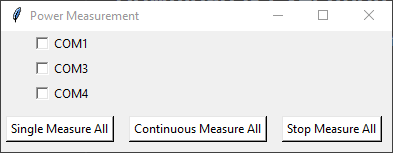
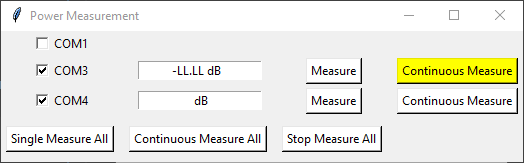

# PM-212_Connection

### Project for managing Optokon PM-212 Optical Power Meter
This repository provides a simple interface for interacting with multiple PM-212 optical power readers

## Download & Execution
Just download the `Power Measurement.exe` file and run

## Operation
Upon starting the program, the GUI will display a list of available COM ports, select the ones
corresponding to the devices

After selecting the COM ports, the user will have the option to measure each device once or continually poll it.

Users will also be able to measure each device once or continually poll all of them.

Devices with no data-out signal will display as `-LL.LL`